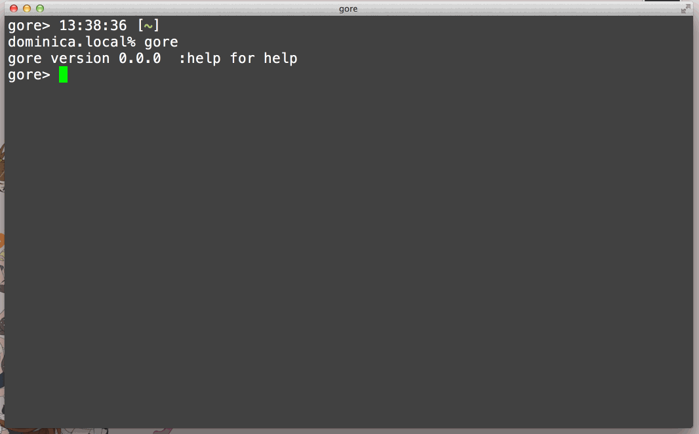

# gore [](https://github.com/x-motemen/gore/actions)
### Yet another Go REPL that works nicely. Featured with line editing, code completion, and more.



(Screencast taken with [cho45/KeyCast](https://github.com/cho45/KeyCast))

## Usage

```sh
gore
```
After a prompt is shown, enter any Go expressions/statements/functions or commands described below.

To quit the session, type `Ctrl-D` or use `:q` command.

## Features

- Line editing with history
- Multi-line input
- Package importing with completion
- Evaluates any expressions, statements and function declarations
- No "evaluated but not used" errors
- Code completion (requires [gocode](https://github.com/mdempsky/gocode))
- Showing documents
- Auto-importing (`gore -autoimport`)

## REPL Commands

Some functionalities are provided as commands in the REPL:

```
:import <package path>  Import package
:type <expr>            Print the type of expression
:print                  Show current source
:write [<filename>]     Write out current source to file
:clear                  Clear the codes
:doc <expr or pkg>      Show document
:help                   List commands
:quit                   Quit the session
```

## Supported Versions
Only the latest major version.

## Installation
The gore command requires Go tool-chains on runtime, so standalone binary is not distributed.

```sh
go install github.com/x-motemen/gore/cmd/gore@latest
```

Make sure `$GOPATH/bin` is in your `$PATH`.

Also recommended:

```sh
go install github.com/mdempsky/gocode@latest   # for code completion
```

Or you can use Docker:

```sh
git clone https://github.com/x-motemen/gore.git
cd gore
docker build -t gore .
docker run -it --rm gore
```

## FAQ/Caveats

- gore runs code using `go run` for each input. All the inputted lines are
  evaluated again and again so you can't bind the evaluated time by
  `time.Now()`, for example. If you don't like this behavior, you may want to use
  [yaegi](https://github.com/containous/yaegi).
- gore support Go modules. You can load local modules when you start gore at
  the project directory. You don't need to `go get` to check the usage of a
  remote repository, `:import github.com/...` will automatically download that
  module. Also, you don't need to `go get` the pretty print module anymore. If
  you want to load a local code from `$GOPATH`, you need to create the modules
  file (`go mod init ...`) and then start gore at the project directory.

## License

[The MIT License](./LICENSE).

## Author

motemen &lt;<motemen@gmail.com>&gt;
